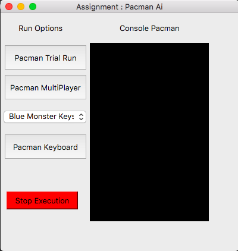

# Ai-Pacman-Multiplayer
pacman game in python uses Pacman Game ui Library by Univerity texas .   
  
[](https://travis-ci.org/joemccann/dillinger)
# Pacman Ui




# Execution Method
**Requires Python 2.7 Only  !**    

```sh
python capture.py 
python capture.py -l tinyCapture.lay 
python capture.py -r BaselineAgents -b BaselineAgents 
python capture.py --blueOpts first=keys  
```

1. Commands Menu
     - Command 1 will run Pacman with Default Layout and Automatic Gameplay
     - Command 2 will run Pacman with tinyCapture Layout and Automatic Gameplay
     - Command 3 will run Pacman with Default Layout and Automatic Gameplay with Multiplayer
     - Command 4 will run Pacman with Default Layout and blue first ghost as Keyboard Gameplay
     - -l can specify layouts in the layouts folder as in 2nd commands 
     - all commands can be joined
